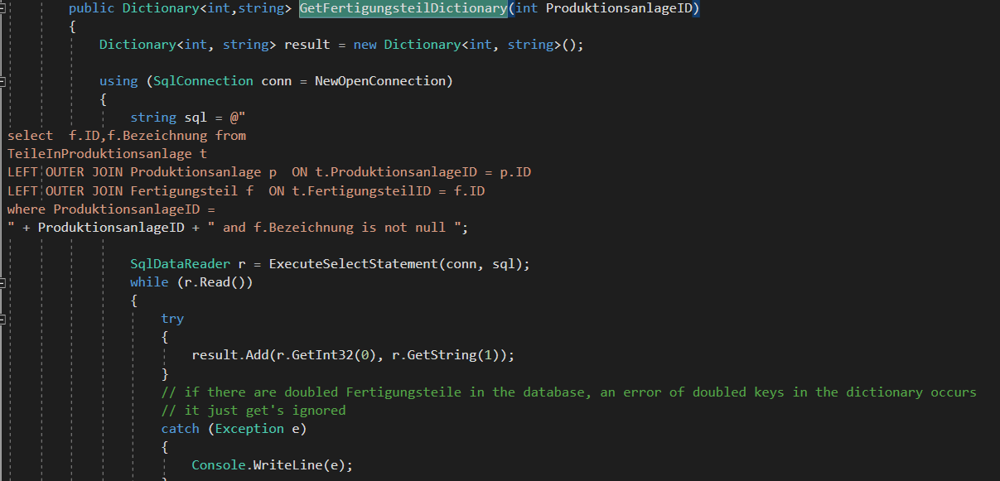
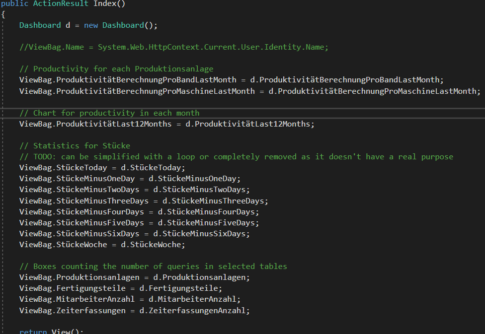

Stand: 02.03.2020	Anwendung zum Eintragen von Schichtdaten und deren Auswertung.

Vorwort:	

Dieser Dokument ist keine richtige Programmierdokumentation, sondern nur	
eine Einleitung mit ein paar Erklärungen, wie was implementiert wurde,	
damit man sich besser orientieren kann. Der Code ist hoffentlich	
ausreichend kommentiert.	

Inhaltsverzeichnis  {#inhaltsverzeichnis .TOC-Heading}	
==================	

[Einleitung zu den benutzen Technologien	
1](#einleitung-zu-den-benutzen-technologien)	

[Überblick 2](#überblick)	

[Datenbank 2](#datenbank)	

[Models 3](#models)	

[Mapping 3](#mapping)	

[SQLServer.cs 4](#sqlserver.cs)	

[Berechnung der Produktivität 4](#berechnung-der-produktivität)	

[Views und Controllers 4](#views-und-controllers)	

[NeueZeiterfassung 5](#neuezeiterfassung)	

[Home 7](#home)	

[TeileInProduktionsanlage 9](#teileinproduktionsanlage)	

[MitarbeiterInSchicht 10](#mitarbeiterinschicht)	

[Login und Benutzerverwaltung 11](#login-und-benutzerverwaltung)	

[Probleme und Verbesserungvorschläge	
13](#probleme-und-verbesserungvorschläge)	

Einleitung zu den benutzen Technologien	
---------------------------------------	

Die Anwendung wurde in Visual Studio 2017 entwickelt mit MVC Design	
Muster.\	
\	
Es wurde dabei die Vorlage von ASP.NET MVC Framework angewendet. Als	
Datenbankserver wurde der SQL Server 2017 benutzt.\	
Für die Lösung wurde nicht das Entity Framework benutzt, was oft der	
Standard ist, sondern für das Mapping der Datenbank Queries und des	
Models wurde das Package Dapper eingesetzt. Das heißt, viele Funktionen	
wurden an den Datenbankserver verlegt, um mehr Flexibilität bei Änderung	
der Datenbank zu gewinnen.	

Dokumentation und Tutorial zur MVC:	
<https://dotnet.microsoft.com/apps/aspnet/mvc>	

Dokumentation und Tutorial zum Dapper: <https://dapper-tutorial.net/>	

Für das Frontend wurde kein Framework angesetzt, sondern einfaches	
Javascript, ergänzt mit Bootstrap und teilweise JQuery.	

Überblick	
---------	

{width="4.0005588363954505in"	
height="4.834008092738408in"}	

Die Hauptfunktionalitäten sind In Models, Controllers und Views	
Verzeichnisse. Die weitere wichtige Klasse ist der SQLServer.cs in Data	
Folder, die die Daten aus der Datenbank holt.	

Datenbank	
---------	

Die Datei zur Herstellung der Datenbank befindet sich unter	
SQL\_Scripts.sql in	
\~\\ZeiterfassungPierburg\\ZeiterfassungPierburg\\bin\\Release\\Publish.	

Es gibt 5 Tabellen, die miteinander mit Fremdschlüssel verbunden sind.\	
Die Kerntabelle ist dabei die MitarbeiteInSchicht, in der die gesamten	
Informationen über einzelne Schichteinträge enthalten sind.\	
Die Zugriffsrechte Tabelle dient der Speicherung der Benutzerdaten und	
TeileInProduktionsanlage verkuppelt die Produktionsanlage und	
Fertigungsteil Tabelle, jedoch ohne Fremdschlüssel, ohne unnötige Fehler	
zu verursachen.	

{width="6.268055555555556in"	
height="4.124305555555556in"}	

Abbildung 1: Datenbank Schema	

Jeder Eintrag entspricht immer einer ID in MitarbeiterInSchicht Tabelle.	
Schichtinfo enthält Informationen über den Zeitpunkt (bei Art 1=	
Frühschicht, 2=Spätschicht, 3=Nachtschicht). Produktionsanlage enthält	
Info über Bänder und Maschinen, wobei der einzige Unterschied zwischen	
den beiden ist der bool Wert *IstEineMaschine*.	

Models	
------	

In Models Folder sind die Modelklassen und auch die Viewmodels	
gespeichert. Es wird nicht deutlich zwischen den beiden unterscheidet,	
die meisten Modelle dienen gleichzeitig auch als Viewmodels.	

Alle Modelle erweitern die *BasicModelObject* Klasse. Diese Klasse	
enthält die ID des Models, die als Key für Dapper notwendig ist.	

Mapping	
-------	

Das Mapping von Modellen und den Datenmodellen erfolgt mithilfe der	
Dapper Package . Das Mappen selbst passiert in Controller resp. in	
SQLServer Klasse; was man jedoch beachten muss ist, dass die Tabelle in	
SQL Server genauso heißt wie die Klassen, sonst ist es notwendig, den	
Tabellenamen als Attribut hinzuzufügen. Die Tabellennamen (oder Namen	
der Spalten in einer SQL Query) und die Properties des Models müssen	
auch genauso heißen, damit das Mapping erfolgreich ist.	

{width="6.268055555555556in"	
height="2.4791666666666665in"}	

SQLServer.cs	
------------	

SQL Server Klasse ist der Kern der Anwendung. Einzelnen Methoden ziehen	
die Daten aus dem Server und arbeiten weiter mit Ihnen für die Nutzung	
der Anwendung.	

Die Funktionalität der Klasse ist sowohl das Laden der Daten als auch	
für Berechnungen anderer Daten wie z.B. der Produktivität. Wenn man in	
VS alle Methoden einklappt, sieht man die Beschreibung der Gruppen der	
Funktionen.	

Die wichtigsten Methoden sind die Datenmanipulierungsmethoden (CRUD).	

Künftige Verbesserung wäre z.B. eine Einteilung in mehreren Klassen von	
wegen Übersichtlichkeit.	

### Berechnung der Produktivität	

In dem Publish Ordner gibt es die Datei *Produktivitätberechnung.xlxs*,	
die ein Exceltabelle enthält. Damit kann man besser nachvollziehen, wie	
die Produktivität berechnet wird.\	
In der Anwendung gibt es mehrere Funktionen, die die Produktivität	
berechnen, mit verschiedenen Faktoren.	

Prinzipielle muss immer folgendes gemacht werden:\	
1) Wähle alle distinkte SchichtInfoID von MitarbeiterInSchicht Tabelle	
aus der Datenbank, die den Eingangskriterien entsprechen (z.B. BandID)	
und speichere diese in eine Liste.	

2\) Aus jeder Schicht summiere die Produktivzeit und Anwesenheit. (Wird	
von Stückzahl, teZeiten, Anzahl der Mitarbeiter berechnet). Der Befehl	
für jede Schicht kann so aussehen :	

{width="6.072916666666667in"	
height="2.2317607174103236in"}	

Warum die Berechnung so aussieht kann man mithilfe der Exceltabelle	
bestimmen.	

3\) Berechne die Produktivität als Produktivzeit / Anwesenheit \* 100.	

**PRODUKTIVITÄT MUSS NOCH GETESTET WERDEN**	

Views und Controllers	
---------------------	

Als Designvorlage wird das Layout AdminLTE	
<https://github.com/ColorlibHQ/AdminLTE> verwendet. Es ist eine css und	
js Erweiterung von Bootstrap.\	
Die meisten Views sind direkt an die Models gebunden und sind nur leicht	
unterschiedlich von den defaulten CRUD Views generiert von ASP.NET.	

Die nicht-Standarte Views sind die in folgen Folders:*\	
Home, Neuezeiterfassung, TeileInProduktionsanlage, Mitarbeiter/Details,	
Produktivität*	

Für alle anderen gilt folgend:	

*Create* und *Update* werden direkt von den Modellen abgeleitet. Die	
Validierung kommt auch von den Modellen und kein zusätzliches JS Code	
ist geschrieben. *\	
Index* Views sind von Bootstrap's DataTables erweitert:\	
<https://datatables.net/examples/styling/bootstrap4>	

DataTables ist eine css und Javascript Erweiterung, die vereinfacht die	
Ansicht der Tabelle und ermöglicht die Sortierung und Suche.	

### NeueZeiterfassung	

[Views:]{.underline}	

***Create**\	
*Create View dient dem Speichern der Daten in die MitarbeiterInSchicht	
Tabelle. Weil bei jedem Eingeben mehrere Einträge gespeichert werden,	
wird die Form als Formcollection and den Controller übergeben und nicht	
als Model. In Controller wird durch die gesamte Collection iteriert und	
die Werte anhand der „name" Attribut gelesen.\	
Deswegen werden an erster Stelle im Javascript die Attribute umbenannt,	
damit man in Controller eine Schleife machen kann.*\	
*{width="3.26415135608049in"	
height="2.438892169728784in"}	
Die Ansicht ist gemacht mittels Tabellen:\	
- die erste Tabelle für die allgemeine Daten für alle Einträge	
(Produktionsanlage, Datum, Schucht)\	
- die zweite Tabelle für das Hinzufügen der Fertigungsteile\	
- die dritte Tabelle für das Hinzufügen der Mitarbeiter\	
Die zweite und die dritte Tabelle haben einen dynamischen Anzahl der	
Zeilen. Dies erfolgt durch die „Plus" und „Minus" Buttons und deren	
zugewiesenen Funktionen *AddRowTeile*, *AddRowMitarbeiter* und	
*RemoveRow*. Bei jedem Klick wird die erste Zeile kloniert und die	
Attribute angepasst. Danach wird sie als letzte Zeile angehängt.\	
{width="4.509433508311461in"	
height="2.8387543744531936in"}	
Entsprechend wird die *RemoveRow* Tabelle implementiert, wo beim Klicken	
auf den „Minus" Button eine Zeile gelöscht wird.\	
Wichtig ist noch die Funktion für das asynchrone Laden der	
Fertigungsteile anhand der Produktionsanlage(ID).	
{width="6.268055555555556in"	
height="1.9666666666666666in"}	
In dieser Funktion wird die ProduktionsanlageID gelesen und wird an den	
Controller weitergegeben. Der liest alle Fertigungsteile von der	
TeileInProduktionsanlage Tabelle und gibt die entsprechende Bezeichner	
der Fertigungsteile zurück.\	
***CreateMeba\	
CreateMeba ist genauso aufgebaut wie Create mit dem Unterschied, dass	
bei der Eingabe nur ein Mitarbeiter eingegeben wird.***	

***[Controller:\	
]{.underline}Die auschlaggebende Funktion beim Controller ist nun die	
HttpPost** Create**(model, Formcollection).***	

***Der Ablauf der Create(NeueZeiterfassung model, FormCollection col)	
Funktion ist folgend:***	

1.  ***Lese Datum und Schicht aus, erstelle die SchichtInfo Modelklasse	
    und füge diese in die Datenbank hinzu.***	

2.  ***Lese die ProduktionsanlageID aus.***	

3.  ***Speichere die Uhrzeit der Tätigkeit und falls vorhanden,	
    speichere den Benutzernamen.***	

4.  ***Erstelle ein Dictionary mit allen Formeinträgen und eine Liste	
    von allen Keys.***	

5.  ***Zähle, wie viele Fertigungsteile und wie viele Mitarbeiter es zum	
    Hinzufügen gibt indem die Anzahl der Keys gezählt wird, die mit	
    ‚fteil', resp. mit ‚name' anfangen.***	

6.  ***Iteriere durch alle Mitarbeiter***	

    a.  ***Kontrolliere, ob bei jedem Mitarbeiter die Summe der	
        indirekten und direkten Stunden größer 0 ist: diese sollte	
        künftig ersetzt werden durch eine JS Funktion clientseitig***	

    b.  ***Iteriere durch alle Fertigungsteile***	

        i.  ***Erstelle das MitarbeiterInSchicht Model, in dem alle	
            notwendige Parameter ausgelesen werden und füge dies in eine	
            Liste***	

7.  ***Hinzufüge alle MiarbeiterInSchicht Modelle von der Liste in die	
    Datenbank.***	

8.  ***Falls ein Fehler auftritt, lösche alle Einträge.\	
    ***	
Die ***CreateMeba Funktion funktioniert ähnlich, mit dem Unterschied,	
dass es keine Schleife über die Mitarbeiter gibt, denn es gibt immer nur	
einen. (Punkt 6 aus der Liste fällte aus)***	

***Die Funktion in Controller, die für das Laden der Fertigungsteile	
verantwortlich ist, ist die Fetcheritungsteile* Funktion.**	
{width="6.268055555555556in"	
height="0.9076388888888889in"}	
Abbildung 2 NeuezeiterfassungController: Fetchfertigungteile	
**Sie nimmt die ProduktionsanlageID und mithilfe des SQLServers holt	
alle IDs und Bezeichnungen der Teile, die zu der Anlage gehören. Dabei	
ist zu beachten, dass falls ein Teil doppelt zu einer Anlage zugeteilt	
wurde, gäbe es ein Problem bei dem Dictionary von wegen doppeltem Key.\	
Beim Auslesen des doppeltem Key wird der redundante Eintrag gefangen und	
ignoriert.**	
{width="6.268055555555556in"	
height="3.017361111111111in"}	
Abbildung 3 SQLServer: GetFertigungsteilDictionary	
### Home	
**[Views:]{.underline}**	
**Home Verzeichnis verfügt nur über ein View, was als Dashboard und	
Hautpseite der Anwendung dient.**	
***Index.cs***	

**Der View is in einer Form von mehreren Bootstrap Boxen aufgebaut. Die	
Daten werden aus verschieden Datanbanken in der SQLServer Klasse	
ausgelesen und in Index.cs in eine Sicht lesbare Sicht bearbeitet.\	
Bei den ersten 4 farbigen Boxen werden nur Daten von ViewBag gelesen.\	
\	
TODO: Produktivität**	

**Die Statistik der Stücke ist auch von ViewBag gelesen.**	

**Placeholder für Pronom -- dort sollte ein *iframe für Promon Anwendung	
hinzugefügt werden (falls es geht). Jetzt steht da nur die Wikipedia	
Seite. ***	

***[Controllers:]{.underline}***	

***HomeController***	

***In HomeController werden lediglich nur die ViewBags erstellt, die von	
den Models hergeleitet sind.***	

{width="6.268055555555556in"	
height="4.322222222222222in"}	

***In der Modelklasse werden mithilfe des SQLServers, wie z.B. die die	
Anzahl der Stücke in der letzten Woche:***	

{width="6.268055555555556in"	
height="1.1416666666666666in"}	

### TeileInProduktionsanlage 	

Tiele InProduktionssanlage ist dafür gemacht, dass nach der Auswahl	
einer Produktionsanlage nur die zugewiesene Teile angezeigt werden. Das	
verkuppelt die gleichgenannte Tabelle, die bei einem Eintrag die ID der	
Produktionsanlage und die ID des Fertigungsteils speichert.\	
Die ModelViews entsprechen der Ausgabe des SQL Befehls in *SQLServer*	
Klasse.	

[Controller:]{.underline}	

public ActionResult Index()	

Für die Ansicht alle Einträge werde sie erstmal in SQLServer Klasse	
geholt und so ein den View übergeben.	

{width="3.6041666666666665in"	
height="1.9338549868766404in"}	

public ActionResult Edit(int id)	

Für Edit (und Create) wird ein Extra ModelView erstellt. In SQL Server	
werden die Produktionsanlage und Fertigungsteil des	
TeileInProduktionsanlage Eintrag geholt.	

{width="4.28125in" height="3.261926946631671in"}	

In View wird dann anschließend die Option mit dem Wert es editierten	
Eintrag ausgewählt.	

{width="4.905904418197725in"	
height="0.9479166666666666in"}	

### MitarbeiterInSchicht 	

[Views:]{.underline}	

***Index.cs und IndexMEBA.cs***	

Diese ist die häufigst genutze Ansicht der Anwendung, denn es werden	
dort die Einträge gespeichert.\	
Es ist eine Tabelle, die durch DataTables erweitert wird mit ein Paar	
Änderungen:	

Das Datum wird am Anfang an Monat-1 gesetzt. Es werden 3 weiteren	
Faktoren für das Filtern der Einträge gesetzt: das Datum, die Anlage und	
die Schicht. Es gibt von DataTables vorgefertigte Filterfuktion, die	
über die 3 Faktoren erweitert wurde:\	
{width="6.268055555555556in"	
height="2.6333333333333333in"}\	
Die Liste der Anlagen wird von SQLServer geholt. Dies wird etwas	
ungeschickt als Html code generiert und über ViewBag vom Controller	
übergeben -- da sollte man sich künftig eine bessere Lösung überlegen.	

{width="6.268055555555556in"	
height="1.2708333333333333in"}	

Es wird durch die gesamte Tabelle iteriert und abhängig von dem Bool	
Wert von IstEingetragen wird die Farbe der Zeile rot/grün.\	
Es gibt noch eine dynamische Funktion zum Eintragen oder nicht, die	

Login und Benutzerverwaltung	
----------------------------	

Es war gewollt, dass man keine Windows Authentifizierung benutzen sollte	
(?), deswegen ist in der Anwendung noch eine primitive	
Sicherheitsschichte mit Benutzernamen und Passwort implementiert. Die	
Passwörter sind nicht gehashed und werden in Klartext in der Datenbank	
gespeichert.	

Beim Einloggen wird tatsächlich nur der Benutzername mit dem Password	
verglichen. Im Controller wird beim Hinzufügen eines Benutzernamens	
gesorgt, dass dieser eindeutig ist.\	
{width="6.268055555555556in"	
height="2.7819444444444446in"}	

Es gibt 2(3) Unterschiedlich Zugriffschichten: der Admin, der Verwalter	
(und der Benutzer ohne Login).\	
Der uneingeloggte Benutzer hat nur Zugriff auf „Neue Zeiterfassung". Der	
Verwalter auf alles andere außer Zugriffsrechte. Der Admin darf auch	
Zugriffsrechte vergeben.\	
Der Zugriff wird nur damit eingeschränkt, in dem es 2 verschiedene	
Layouts gibt. Einmal ist das der Layout für öffentlichen Zugang	
*\_LayoutPublic* und für die eingeloggten User der *\_Layout*. Im	
*\_Layout* wird der AccessLayer befragt:	

{width="3.6132075678040243in"	
height="1.128669072615923in"}	

Je nach dem AccessLayer wird unterschiedlicher Inhalt geladen. Soweit	
ist der Unterschied nur das Menuitem *Zugriffsrechte*. In Views, die	
unter *Zugriffsrechte* gehören, wird der AccesLayer von SessionInfo	
nochmal gefragt und wenn der Benutzer kein Admin ist, wird es oder sie	
auf AccessDenied Seite umgeleitet.\	
Da *Delete* Methoden nur über dir URL erfolgen, wird in jeweiligen	
Controllers auch nach der Zugriffsschichte gefragt, wie am Beispiel von	
*MitarbeiterInSchichtController*.	

{width="6.268055555555556in"	
height="2.2423611111111112in"}	

Die von ASP.NET generiert MVC Inhalte sind für eventuelle spätere	
Implementierung beibehalten, in dieser Lösung werden jedoch nicht	
benutzt.	

Probleme und Verbesserungvorschläge	
-----------------------------------	

-   Man kann Javascript Code bei den Tabellen vereinfachen, um weniger	
    in DOM durchqueren zu müssen, denn die Tabelle brauchen relativ	
    lange zum Laden.	

-   Einige Links und URLs sind hardgecoded.	

-   SQLServer Funktionen kann man zusammenfassen und parametrisieren, um	
    die bestehende Redundanz zu vermeiden.
